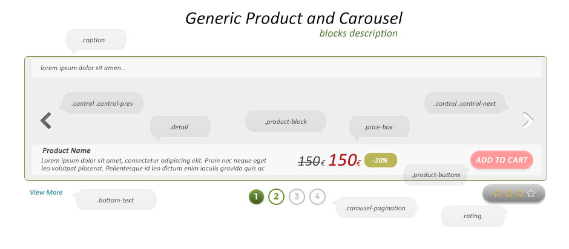
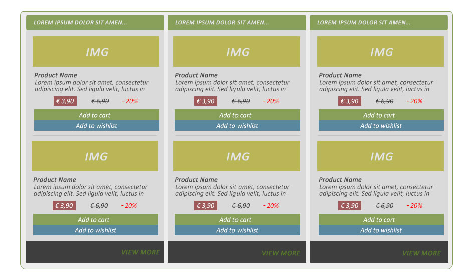
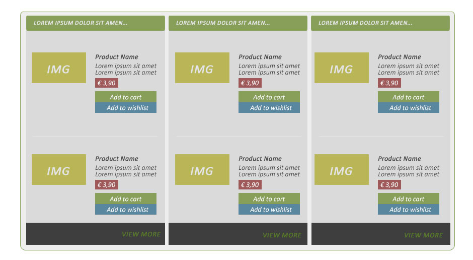
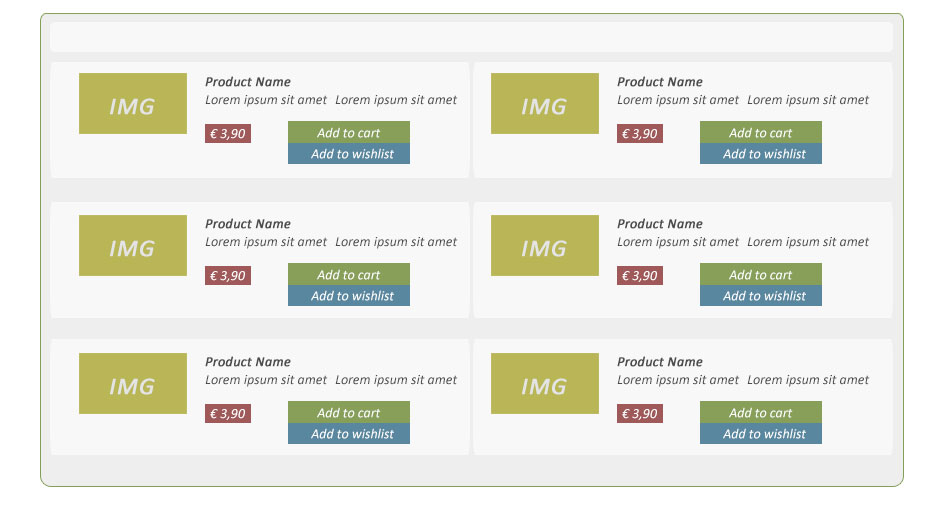
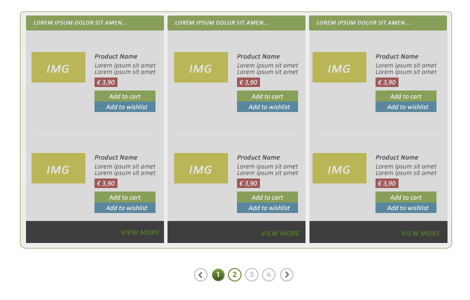
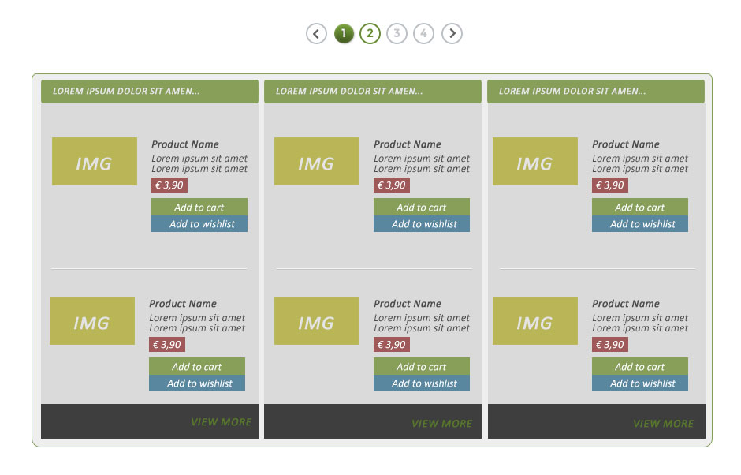
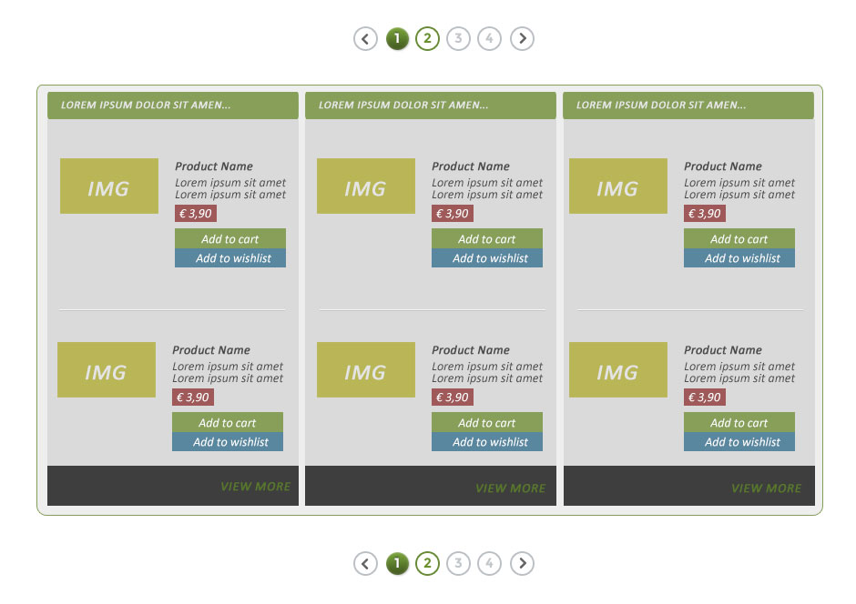
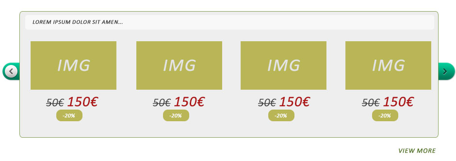
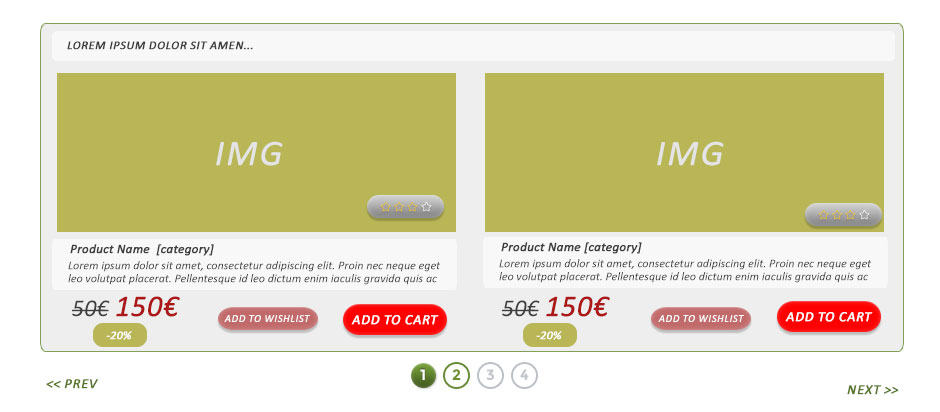

Generic HTML/LESS Block Product/Carousel
================

<h2>Version</h2>
version 1.0.0

<h2>Documentation</h2>

<h6>Require files:</h6>
[blocks-foundation.less](less/blocks-foundation.less) - base file for magento, should be in (skin\frontend\base\default\css\catalog) - don't change this file <br>
[blocks-variables.less](less/blocks-variables.less) - you can edit variables for block products/carousel
and generic HTML (we can't change this html, only add class to container "product-block"):
<h6>Optional files:</h6>
<p>for Pagination</p>
[pagination.less](less/pagination.less) - base file for magento, don't change this file <br>
[pagination-variables.less](less/pagination-variables.less) - and the local file variables

<h2>Block description</h2>  

<h2>HTML Structure</h2>
```html
    <!-- Wrapper Product Block -->
    <div class="product-block">
        <!-- Block Title -->
        <h3 class="block-title"><span class="icon"></span>BLOCK TITLE</h3>
        <h5 class="block-subtitle">BLOCK SUB-TITLE</h5>
        <!-- Product Stage -->
        <div class="product-stage">
            <!-- Product Clip -->
            <ul class="product-clip">
                <li itemtype="http://data-vocabulary.org/Product" itemscope="">
                    <!-- Item -->
                    <div class="product-item">
                        <!-- Number -->
                        <span class="number">1</span>
                        <!-- Product image -->
                        <!-- Product image without link -->
                        
                        <!-- Product image with link -->
                        <a class="image-link" href="#" title="" ></a>
                        <!-- Caption -->
                        <div class="caption"><p>Caption</p></div>
                        <!-- Product detail -->
                        <div class="detail">
                            <!-- Product info -->
                            <div class="info">
                                <!-- Product name -->
                                <h4 class="product-name"><a href="#" itemprop="name">Product name</a></h4>
                                <!-- Product category -->
                                <a class="product-category" href="#" itemprop="category">Product category</a>
                                <!-- Product description -->
                                <p class="product-description" itemprop="description">Lorem ipsum dolor sit amet, consectetur adipisicing elit, sed do eiusmod tempor incididunt ut labore et dolore magna aliqua. Ut enim ad minim veniam, quis nostrud exercitation ullamco laboris nisi ut aliquip ex ea commodo consequat.</p>
                            </div>
                            <!-- Product rating -->
                            <div class="rating" title="Quality" data-rating="4"><meta itemprop="rating" content="4" /></div>
                            <!-- Price Box -->
                            <div class="price-box" itemtype="http://data-vocabulary.org/Offer" itemscope="" itemprop="offerDetails">
                                <meta content="EUR" itemprop="currency">
                                <!-- Special price -->
                                <p class="old-price">
                                    <span class="price-label">Previous price:</span>
                                    <span class="price">4,39&nbsp;€</span>
                                </p>
                                <!-- Current price -->
                                <p class="special-price" itemprop="price">
                                    <span class="price-label">Special price:</span>
                                    <span class="price">3,90&nbsp;€</span>
                                </p>
                            </div>
                            <!-- Product buttons -->
                            <div class="product-buttons">
                                <!-- Button add to cart -->
                                <a class="btn add-to-cart" href="#"><span>Add to cart</span></a>
                                <!-- Button add to wishlist -->
                                <a class="btn add-to-wishlist" href="#"><span>Add to wishlist</span></a>
                            </div>
                        </div>
                    </div>
                </li>
            </ul>
        </div>
        <!-- Bottom text -->
        <div class="bottom-text">
            <a href="#"><span>VIEW MORE</span></a>
        </div>
        <!-- Pagination -->
            <ul class="pagination-container">
                <li class="pagination-previous disabled">
                    <a class="previous" href="#" title="Previous">«</a>
                </li>
                <li class="active">
                    <a href="#">1</a>
                </li>
                <li>
                    <a href="/">2</a>
                </li>
                <li class="disabled dots">
                    <a href="#">...</a>
                </li>
                <li>
                    <a href="/">158</a>
                </li>
                <li class="pagination-next">
                    <a class="next" href="/" title="Next">»</a>
                </li>
            </ul>
    </div>
```

<h2>Block products</h2>
<h6>We just add class to html .product-block for display:</h6>

.display-column - In Column (set default) <br>
  
Example :
```html
    <!-- Wrapper Product Block -->
    <div class="product-block display-column">
        ...
    </div>
```  
.display-list - In List <br>
  
Example :
```html
    <!-- Wrapper Product Block -->
    <div class="product-block display-list">
        ...
    </div>
```  
.display-grid<br>
**2columns**
  
Example:  
```html
    <div class="product-block display-grid">
        ...
    </div>
```  
**3columns**  
We need to add class **'.grid-3columns'** to block
  
Example:  
```html
    <div class="product-block grid-3columns display-grid">
        ...
    </div>
```  

<h2>Block Product With Pagination</h2>
<h6>Bottom pagination</h6>

<h6>Top Pagination</h6>

<h6>Top and Bottom Pagination</h6>

Example HTML :  
```html
    <!-- Pagination -->
    <ul class="pagination-container">
        <li class="pagination-previous disabled">
            <a class="previous" href="#" title="Previous">«</a>
        </li>
        <li class="active">
            <a href="#">1</a>
        </li>
        <li>
            <a href="/">2</a>
        </li>
        <li class="disabled dots">
            <a href="#">...</a>
        </li>
        <li>
            <a href="/">158</a>
        </li>
        <li class="pagination-next">
            <a class="next" href="/" title="Next">»</a>
        </li>
    </ul>
```
<h2>Simple block product carousel</h2>

  
<h6>Carousel products</h6>

To run carousel just add class:

.display-carousel (you must set js)

You can use <a href="http://caroufredsel.dev7studios.com/">carouFredSel</a> or <a href="https://github.com/jsor/jcarousel">jCarousel 0.3</a> carousels

If you want multiple carousels you can add new class to container (.block-product) and add custom styles for example:
```html
    <!-- Wrapper Product Block -->
    <div class="product-block display-carousel custom-styles">
        ...
    </div>
```

Structure to show pagination, next & prev buttons you must set in javascript!
```html
    <!-- Control -->
    <div class="control-wrap">
        <a class="control carousel-prev" href="#"><span>prev</span></a>
        <a class="control carousel-next" href="#"><span>next</span></a>
    </div>
    <!-- Pagination -->
    <div class="carousel-pagination"></div>
```

and javascript code example to run carousel:

```javascript
    /* ----- carouFredSel default ----- */
    // Create Pagination
    $('.custom-styles .product-stage').after('<div class="carousel-pagination pages"></div>');
    // Create Prev & Next Button
    $('.custom-styles .product-stage').after('<div class="control-wrap"><a class="control carousel-prev" href="#"><span>prev</span></a> <a class="control carousel-next" href="#"><span>next</span></a></div>');

    // Run the carouFredSel
    $(".custom-styles .product-clip").carouFredSel({
        responsive  : false,
        circular    : false,
        infinite    : true,
        auto        : true,
        direction   : "left",
        scroll      : {
                        fx              : "scroll",
                        easing          : "cubic",
                        duration        : 700,
                        pauseOnHover    : true
                    },
        prev        : ".custom-styles .carousel-prev",
        next        : ".custom-styles .carousel-next",
        pagination  : ".custom-styles .pages"
    });
```

<h2>How it works</h2>
You can see how it works <a href="http://generic.balmor.eu/product-carousel/">here</a>.

It also works on IE7+
